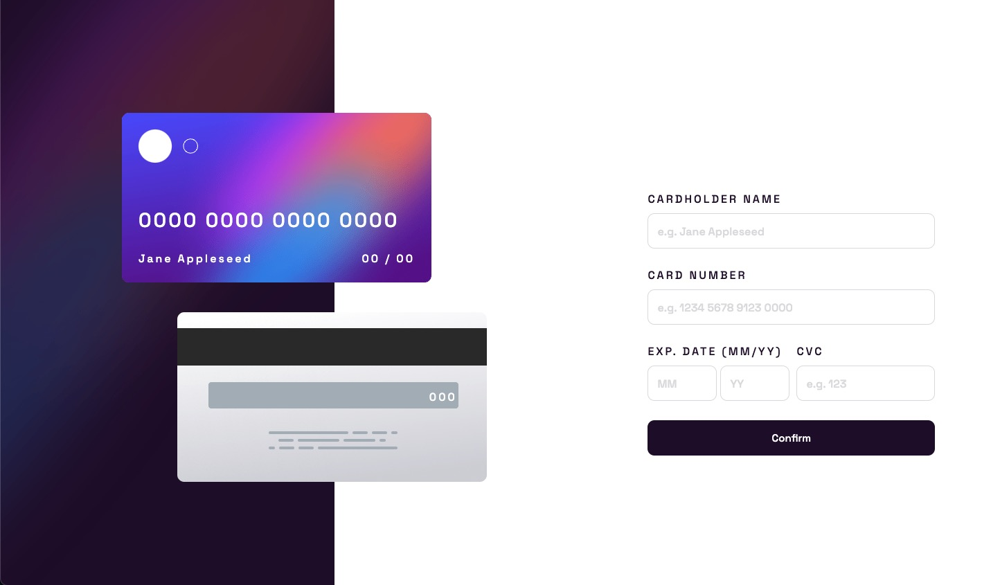

# Frontend Mentor - Interactive card details form solution

This is a solution to the [Interactive card details form challenge on Frontend Mentor](https://www.frontendmentor.io/challenges/interactive-card-details-form-XpS8cKZDWw). Frontend Mentor challenges help you improve your coding skills by building realistic projects.

## Table of contents

- [Overview](#overview)
  - [The challenge](#the-challenge)
  - [Screenshot](#screenshot)
  - [Links](#links)
- [My process](#my-process)
  - [What I learned](#what-i-learned)
  - [Continued development](#continued-development)
- [Author](#author)
- [Acknowledgments](#acknowledgments)

## Overview

### The challenge

Users should be able to:

- Fill in the form and see the card details update in real-time
- Receive error messages when the form is submitted if:
  - Any input field is empty
  - The card number, expiry date, or CVC fields are in the wrong format
- View the optimal layout depending on their device's screen size
- See hover, active, and focus states for interactive elements on the page

### Screenshot

### Links

- Solution URL: [Frontend Mentor](https://your-solution-url.com)
- Live Site URL: [Github Pages](https://shiguita.github.io/FM-Interactive_Card/)

## My process

### What I learned

What caused me the most trouble were the CSS and JS aspects of the challenge. I understand that they are not particularly complex, and once you know what to do, it becomes quite simple. However, I constantly found myself trying to make it more efficient, which ended up taking much more time than I initially anticipated.

I acknowledge that this may not be the best or most efficient solution, but I'm satisfied with it for a first attempt. To implement a desktop view, I ended up using media queries, although I recognize that it may not be the best approach. Unfortunately, I couldn't come up with a better solution and I want to work on other projects.

For the most part, the JavaScript part was mostly a repetition of what I did in the age component challenge.

### Continued development

I still have a lot to learn and improve upon in JavaScript. Each time I work on these small projects, I make incremental progress. I plan to revisit this project and explore different approaches made by other users and expand my understanding of these languages.

## Author

- Frontend Mentor - [@shiguita](https://www.frontendmentor.io/profile/shiguita)

## Acknowledgments

I do want to thank [Alamin](https://github.com/CodePapa360) once again for showing the importance of writing cleaner code.
